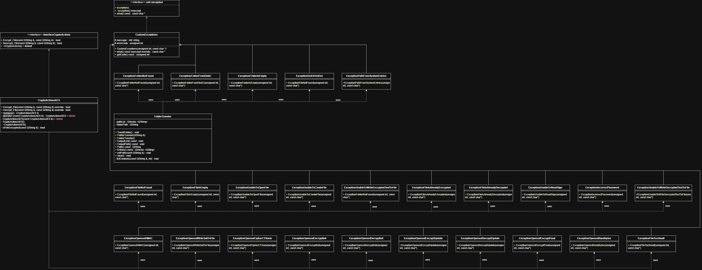

# Secure Develop PO - Lab 1

## Описание
Консольное приложение на C++/Qt для защиты пользовательских данных в папках и подпапках.
Защита выполняется шифрованием всех вложенных файлов. Для восстановления доступа выполняется обратная операция дешифрования.

Проект реализует:
- рекурсивный обход директории и всех вложенных подпапок;
- шифрование/дешифрование файлов по паролю;
- обработку ошибок через собственные классы исключений.

## Описание 
1. Интерфейс приложения: консольный.
2. Библиотека шифрования: OpenSSL (AES-256-CBC, PBKDF2-HMAC-SHA256).
3. Рекурсивный обход папок: реализован средствами Qt (`QDir`, `QFileInfoList`).
4. Язык: C++17.
5. Основной класс шифрования/дешифрования как Singleton: `CryptoActionsAES::Instance()`.
6. Входные данные: путь к папке и пароль.

## UML

## Архитектура
- `main.cpp`
	- консольный сценарий: ввод пути, вывод структуры, выбор режима (`.encrypt`/`.decrypt`), ввод пароля;
	- запуск обработки каждого найденного файла.
- `FolderTraveler`
	- рекурсивно обходит дерево папок;
	- собирает список путей ко всем обычным файлам;
	- игнорирует ярлыки (`.lnk`) и системные записи.
- `CryptoActionsAES` (Singleton)
	- `Encrypt_File(path, password)`;
	- `Decrypt_File(path, password)`;
	- внутренний метод проверки сигнатуры зашифрованного файла.

## Криптографическая схема
- Алгоритм: AES-256-CBC.
- Длина ключа: 32 байта.
- IV: 16 байт.
- Salt: 16 байт (генерируется случайно).
- KDF: PBKDF2-HMAC-SHA256, `10000` итераций.

Формат зашифрованного содержимого файла:
`[SIGN][SALT][VERIFIER][CIPHERTEXT]`

Где:
- `SIGN` - сигнатура для определения, что файл уже зашифрован;
- `SALT` - соль для вывода key/iv/verifier;
- `VERIFIER` - контрольный блок для проверки корректности пароля;
- `CIPHERTEXT` - зашифрованные пользовательские данные.

## Сборка и запуск
### Зависимости
- Qt (Core, qmake);
- компилятор с поддержкой C++17 (MinGW/MSVC);
- OpenSSL (заголовки и библиотеки `libcrypto`, `libssl`).

### Сборка (вариант через qmake)
1. Открыть проект `.pro`.
2. Выполнить qmake и сборку
3. Убедиться, что OpenSSL доступен на этапе линковки и запуска.

### Запуск
После старта программа:
1. Запрашивает путь к директории.
2. Показывает найденное содержимое.
3. Запрашивает режим:
	 - `.encrypt` - шифрование всех найденных файлов;
	 - `.decrypt` - дешифрование всех найденных файлов.
4. Запрашивает пароль.
5. Выполняет обработку для каждого файла.

Дополнительно в интерфейсе используется команда `.reset` для повторного ввода параметров.

## Особенности текущей реализации
- Обработка выполняется "на месте": файл перезаписывается результатом.
- При дешифровании проверяется сигнатура и корректность пароля.
- Пустые файлы не блокируют обработку (выводится предупреждение).
- Для пути с диска `C:\` в текущей логике предусмотрено ограничение (генерируется исключение).

## Обработка ошибок
Проект содержит иерархию пользовательских исключений для:
- ошибок доступа к файлам и записи;
- ошибок криптографических операций OpenSSL;
- некорректного состояния данных (например, неверный пароль, файл слишком мал, файл уже зашифрован/дешифрован).
